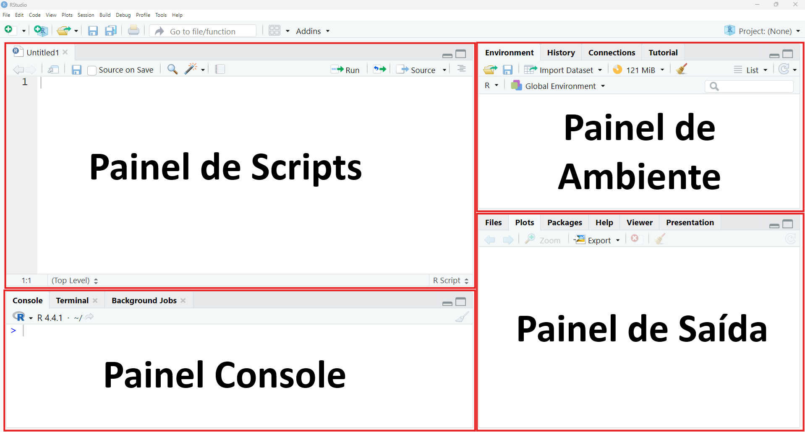

# Aula 01

Pré-requisitos:

-   Instalar o [R](https://cran.r-project.org)
-   Instalar o [RStudio](https://posit.co/downloads)

Instalar os pacotes: - [`sf`](https://cran.r-project.org/web/packages/sf/) - [`terra`](https://cran.r-project.org/package=terra) - [`dplyr`](https://cran.r-project.org/web/packages/dplyr/) - [`data.table`](https://cran.r-project.org/web/packages/data.table/) - [`mapview`](https://cran.r-project.org/web/packages/mapview/) - [`osmdata`](https://cran.r-project.org/web/packages/osmdata/) - [`geobr`](https://cran.r-project.org/web/packages/geobr/) - [`geocodebr`](https://cran.r-project.org/web/packages/geocodebr/)

## Interface do RStudio

Após instalar, em sequencia, o R e o RStudio, abra o RStudio e observe a sua interface (Figura 01).

{fig-align="left"}

### Painel de Scripts

Painel onde você pode editar e salvar scripts em R ou criar documentos computacionais, como Quarto e R Markdown.

### Painel de Ambiente

Painel que exibe os objetos temporários em R à medida que são criados durante a sessão do R.

### Painel Console

Painel utilizado para escrever comandos curtos e interativos em R.

### Painel de Saída

Painel que exibe os gráficos, tabelas ou resultados em HTML gerados pelo código executado, juntamente com os arquivos salvos em disco.

## Regras básicas da sintaxe do R

A seguir são apresentadas as regras básicas da sintaxe da linguagem R

### Como atribuir valores a variáveis

A atribuição de um valor a uma variável é feita através dos operadores `<-` ou `=`:

```{r}
x <- 10
x = 10
```

### Sensibilidade a maiúsculas e minúsculas

O R diferencia atributos e nomes de variáveis em letras maiúsculas e minúsculas:

```{r}
Altura <- 170
altura <- 180

print(Altura)
print(altura)

"SP" == "sp"

```

### Como comentar códigos

Os comentários servem como anotações para organizar o código e torná-lo mais fácil de compreender e replicar. Para inserir um comentário, utilize o operador `#`. Esse operador pode ser utilizado como cabeçalho para descrever blocos de código, no início de uma linha para evitar que o código seja executado ou ao final de uma linha de código. Para comentar um bloco inteiro de código, selecione as linhas desejadas e pressione `Crtl` + `Shift` + `C`:

```{r}
# Vamos agora atribuir o valor 170 para a variável Altura
Altura <- 170

altura <- 180 # Agora atribuímos o valor 180 para a variável altura

# print(altura) # dessa forma evitamos a impressão do valor da variável.

```

## Instalação de pacotes

Para instalar pacotes no RStudio, é utilizada a função `install.packages()` no console do RStudio:

```{r}
#| eval: false
install.packages()
```

Para instalar diversos pacotes de uma única vez, digite no console do RStudio a função `install.packages ()` utilizando como argumento os pacotes `sf`, `terra`, `dplyr`, `data.table`, `mapview`, `osmdata`, `geobr` e `geocodebr`, que são alguns dos pacotes que serão utilizados ao longo da disciplina:

```{r}
#| eval: false
install.packages("sf", "terra", "dplyr", "data.table", "mapview", "osmdata", "geobr", "geocodebr")
```

Após instalar os pacotes, carregue-os na sessão atual através da função `library()`:

```{r}
#| eval: false
library(sf)
```

## Referências:

https://docs.posit.co/ide/user/
